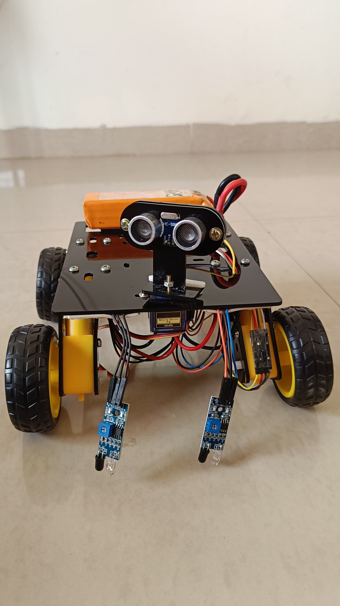
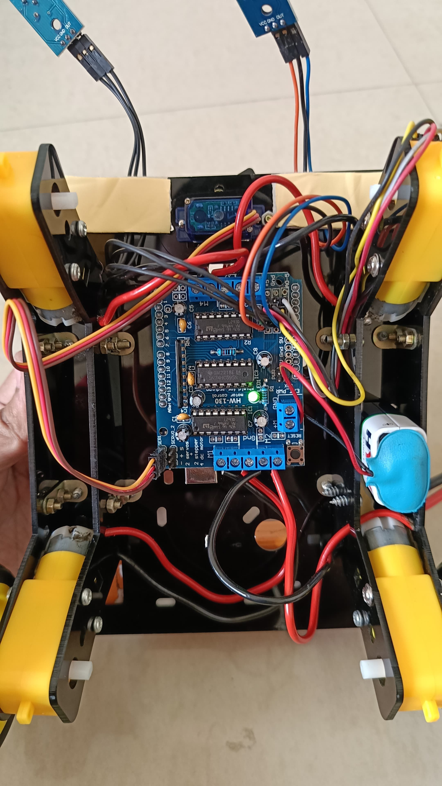

# Line-Following Obstacle Avoidance Robot

Welcome to the Line-Following Obstacle Avoidance Robot project! This repository contains code and documentation for a robot that navigates by following a black line on the ground while avoiding obstacles present on the line.

## Table of Contents
- [Features](#features)
- [Hardware](#hardware)
- [Getting Started](#getting-started)
- [Usage](#usage)
- [Media](#media)
- [Troubleshooting](#troubleshooting)
- [Contributing](#contributing)
- [Author](#author)


## Features

- **Line Following**: The robot uses sensors to detect and follow a black line on the ground.
- **Obstacle Avoidance**: The robot uses ultrasonic and infrared sensors to detect and avoid obstacles on the black line.
- **Servo Integration**: Controls the servo to look left and right for better obstacle detection.
- **Motor Control**: Uses DC motors and a motor driver for controlling the robot's movement along the line.

## Hardware

- **Microcontroller**: Arduino-compatible board (e.g., Arduino Uno).
- **Ultrasonic Sensor**: HC-SR04 sensor for distance measurement.
- **Infrared Sensors**: IR sensors for line detection and obstacle avoidance.
- **Servo**: Standard servo motor for controlling the robot's head movement.
- **DC Motors**: Motors and motor driver for controlling the robot's movement.
- **Motor Driver**: AFMotor library is used to control DC motors.

## Getting Started

### Prerequisites

- Arduino IDE
- Arduino board (e.g., Arduino Uno)
- Required libraries: `NewPing`, `Servo`, `AFMotor`

### Installation

1. Clone this repository:
    ```bash
    git clone https://github.com/Abhishek-2502/Line_Follower_Robot_With_Object_Detection.git
    cd line-following-robot
    ```

2. Install the necessary libraries using the Arduino Library Manager:
    - Open the Arduino IDE and go to `Sketch > Include Library > Manage Libraries`.
    - Search for `NewPing`, `Servo`, and `AFMotor`.
    - Install the libraries if they are not already installed.

3. Connect your Arduino board to your computer.

4. Open the `line_following_robot.ino` file in the Arduino IDE.

5. Compile and upload the code to your Arduino board.

## Usage

Once the code is uploaded to the Arduino board:

- **Connect the hardware**: Connect the ultrasonic sensor, infrared sensors, servo, and DC motors as described in the code.
- **Power the robot**: Provide power to the Arduino board and motors.
- **Observe the robot**: The robot should start following the black line on the ground. It will avoid obstacles present on the line using its sensors.

## Media
 
<p align="center">
    
    
</p>


## Troubleshooting

- If the robot does not follow the line as expected, check the sensor alignment and calibration.
- Ensure the correct libraries are installed and included in the code.
- Check the serial monitor for any debug information.

## Contributing

Contributions are welcome! If you find any bugs or want to suggest improvements, please open an issue or submit a pull request.

## Author

Abhishek Rajput.

